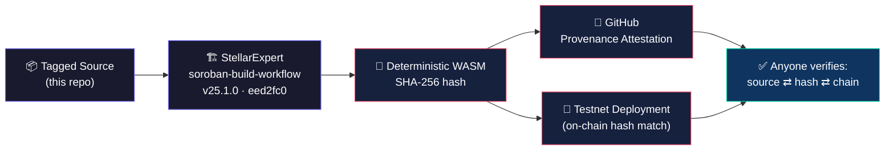
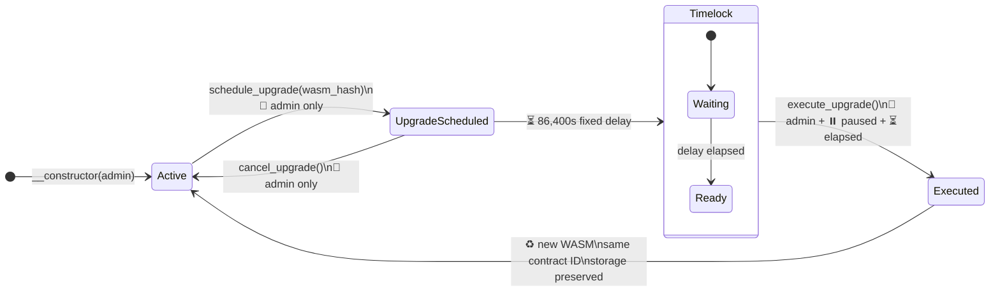
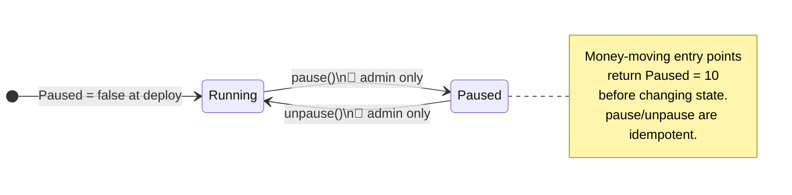
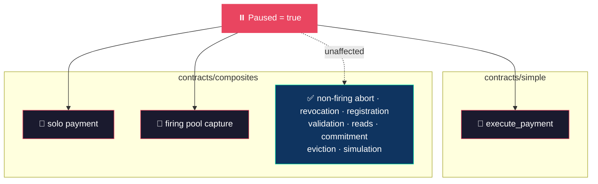
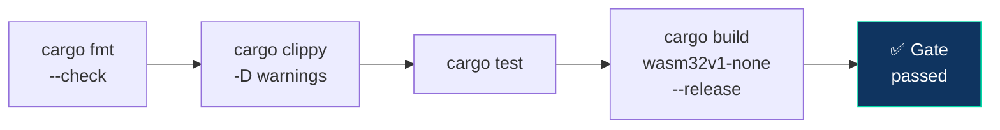
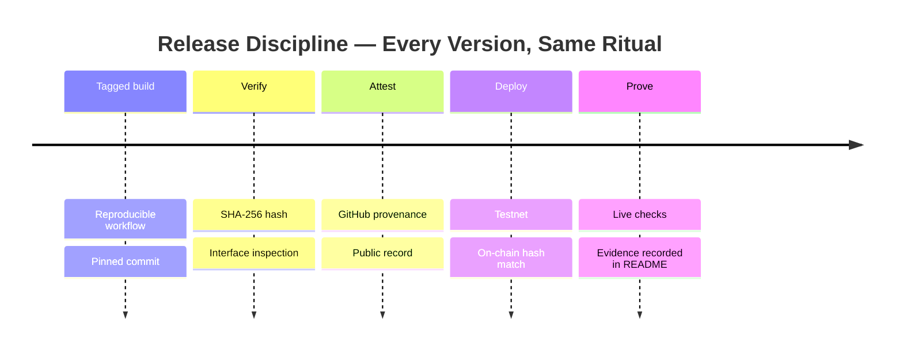

# ⚡ reapp-protocol-contracts

**The on-chain enforcement layer for REAPP — published so anyone can prove the bytecode on Stellar matches this source. No trust. Just hashes.**

[](https://stellar.expert/explorer/testnet)
[](https://soroban.stellar.org)
[](https://www.rust-lang.org)
[](https://github.com/stellar-expert/soroban-build-workflow)
[](https://github.com/reapp-protocol/reapp-protocol-contracts/attestations)

---

## 🔗 Trust Chain — Source to Chain, Cryptographically Welded

Every deployed byte traces back to a tagged commit in this repo. The pipeline is reproducible, attested, and verifiable by anyone with a terminal:



---

## 📁 Contract Arsenal

| Folder | Current testnet contract | Historical testnet contract |
|---|---|---|
| [`contracts/simple`](contracts/simple) | [`CC6JMPDH…CRWE`](https://stellar.expert/explorer/testnet/contract/CC6JMPDHRPBR2HBLJKRCIKV54HXDV2RFXDKW6MALQKWM6JEAJQHICRWE) — release `0.2.0` | [`CB4KOTLG…7ZOA`](https://stellar.expert/explorer/testnet/contract/CB4KOTLGMM5JEPFPU6QBJLADIBP3RSGUX44FOYTFRICNXKKFPYIW7ZOA) — immutable `v0.1.0` |
| [`contracts/composites`](contracts/composites) | [`CCYRF7FK…HEYW`](https://stellar.expert/explorer/testnet/contract/CCYRF7FKYGSNWX5I7WLYXZ6LNUNVCSPE4BOTQFVWVTABOHAP52DYHEYW) — release `0.3.0` | [`CBALARHT…WOQX`](https://stellar.expert/explorer/testnet/contract/CBALARHTO5D7JLWHZ5KST4QNIRC64JI5H3DQDHMIUBSRLLOVS6FCWOQX) — immutable `v0.2.0` |

Both contracts keep the crate name `mandate-registry`, but their package versions and release tags are distinct. The historical deployments remain available as **immutable source anchors**; the current deployments add **pause**, **authority rotation**, and **timelocked same-address upgrades**.

---

## 🛡️ Shared Upgrade Controls

Both current contracts bolt on the same operational surface — **without touching existing mandate or pool encodings**.

### Upgrade Lifecycle — 24-Hour Timelock, No Exceptions



**Three gates on `execute_upgrade`:** current admin authorization, elapsed 24-hour delay, and paused state. Contract ID and storage survive the swap.

### Emergency Stop — Pause State Machine



### What Gets Frozen When Paused



### Full Control Surface

| Addition | Type or signature | Behavior |
|---|---|---|
| `Admin` | instance `Address` | Set by the constructor; authorizes pause, unpause, rotation, and the upgrade lifecycle. |
| `Paused` | instance `bool` | Starts `false`; when `true`, money-moving entry points return `Paused = 10` before changing state. |
| `PendingUpgrade` | instance `Option<PendingUpgrade>` | Stores the proposed WASM hash and its earliest execution timestamp. |
| `__constructor` | `(admin: Address)` | Establishes the initial admin and active state atomically at deployment. |
| `get_admin` | `() -> Address` | Returns the current operational authority. |
| `set_admin` | `(new_admin: Address)` | Requires the current admin and transfers future control. |
| `pause` / `unpause` | `() -> ()` | Require the current admin and are idempotent. |
| `is_paused` | `() -> bool` | Exposes the emergency-stop state without authorization. |
| `schedule_upgrade` | `(new_wasm_hash: BytesN<32>) -> u64` | Requires the current admin and starts the fixed 24-hour delay. |
| `cancel_upgrade` | `() -> ()` | Requires the current admin and removes the pending upgrade. |
| `execute_upgrade` | `() -> ()` | Requires the current admin, elapsed delay, and paused state; replaces WASM while preserving contract ID and storage. |
| `get_pending_upgrade` | `() -> Option<PendingUpgrade>` | Returns the pending hash and earliest execution timestamp. |
| `get_upgrade_delay` | `() -> u64` | Returns `86,400` seconds. |

---

## 🧪 Build and Test Locally

Run the same gate check used by CI and tagged releases:

```bash
./scripts/gatecheck-contracts.sh
```

Or run one contract directly.

**⚙️ Simple mandate contract:**

```bash
cd contracts/simple/mandate-registry
cargo fmt --all -- --check
cargo clippy --all-targets -- -D warnings
cargo test
cargo build --target wasm32v1-none --release
```

**⚙️ Composite mandate contract:**

```bash
cd contracts/composites/mandate-registry
cargo fmt --all -- --check
cargo clippy --all-targets -- -D warnings
cargo test
cargo build --target wasm32v1-none --release
```



Zero warnings tolerated. Same gate, local and CI.

The current gate check runs **27 simple tests** and **64 composite tests**. Each
suite includes a positive timelocked-upgrade lifecycle that uploads replacement
WASM, proves early and unpaused execution fail, executes while paused, calls the
replacement at the original contract ID, and confirms administrator, pause,
pending-upgrade, and mandate storage behavior across the swap.

---

## 🧾 Current Release Evidence

Both current deployments use the **exact WASM** produced by the [StellarExpert soroban-build-workflow](https://github.com/stellar-expert/soroban-build-workflow) at commit `eed2fc012b1eee9a7345d353c55e7f575167dcfc`.

| Contract | Release artifact | SHA-256 and on-chain hash | Deployment | Attestation |
|---|---|---|---|---|
| Simple `0.2.0` | [`mandate-registry_v0.2.0.wasm`](https://github.com/reapp-protocol/reapp-protocol-contracts/releases/tag/simple-v0.2.0_contracts_simple_mandate_registry_mandate-registry_pkg0.2.0_cli25.1.0) | `13f7023d4a361b6e49d3d39f61f55c5eeece51a602013a3cddae420d2ce8552b` | [`8de14e51…5f066`](https://stellar.expert/explorer/testnet/tx/8de14e51a41aaad7a59d91efdff8e587d6f8d31e30688b992257f9dd84c5f066) | [GitHub provenance](https://github.com/reapp-protocol/reapp-protocol-contracts/attestations/34875671) |
| Composite `0.3.0` | [`mandate-registry_v0.3.0.wasm`](https://github.com/reapp-protocol/reapp-protocol-contracts/releases/tag/composites-v0.3.0_contracts_composites_mandate_registry_mandate-registry_pkg0.3.0_cli25.1.0) | `b3368d7fb68017d078792b125dff0389d4c4c893c86fb075baeb9100f0e0f0a1` | [`a93d1d7d…35bbb`](https://stellar.expert/explorer/testnet/tx/a93d1d7d34132cc185d1a89f4fa2c669fba7ff4b1ca1798ab921250776b35bbb) | [GitHub provenance](https://github.com/reapp-protocol/reapp-protocol-contracts/attestations/34875680) |

**Historical anchors:**

| Contract | Immutable hash |
|---|---|
| Simple `v0.1.0` | `4eb1b9430bd4a978348e7efc283a0bf599df048216a43b582921c17daed8c69e` |
| Composite `v0.2.0` | `6333c20b490a570ed7b1c8cbfbf382da00ee8a0d1e4ef1ba013d02fa1cf16f44` |

Every future release repeats the ritual: **tagged build → hash + interface inspection → attestation → deployment → live checks → recorded evidence.**



---

## 🌐 Protocol, SDK, and Proof

This repo is **just the enforcement contract**. The full protocol, SDK, x402 round-trip, reference apps, security gate checks, and clause-by-clause on-chain proof live in:

👉 **[`reapp-protocol/reapp-protocol`](https://github.com/reapp-protocol/reapp-protocol)**

*Verify everything. Trust nothing.*
