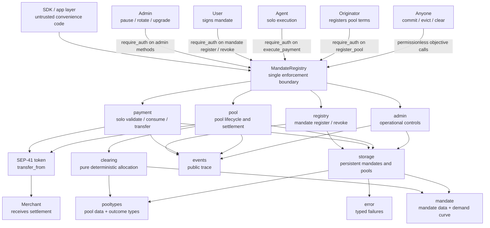
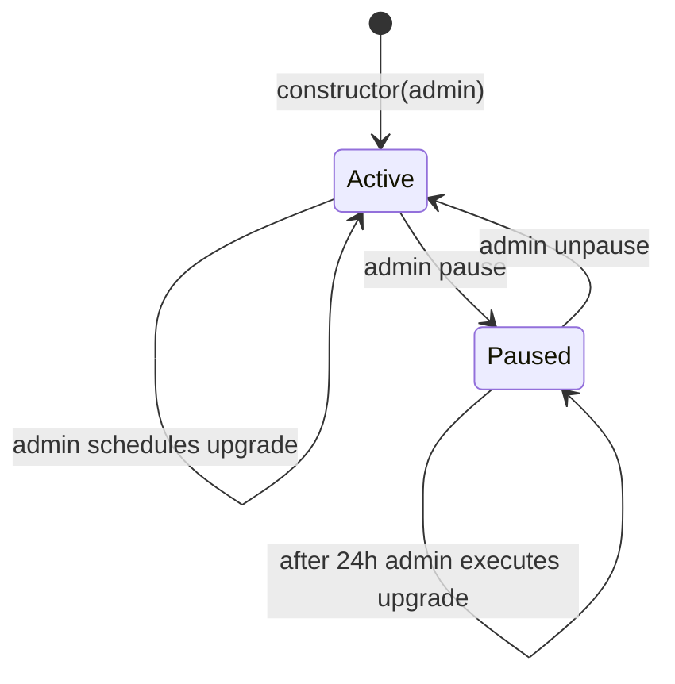
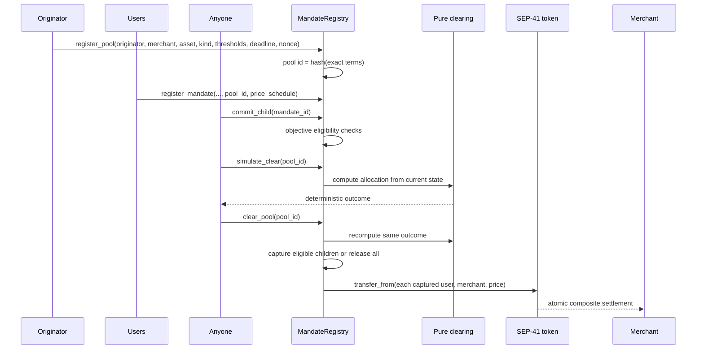
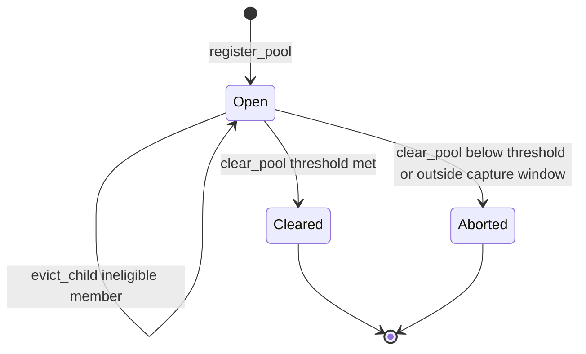
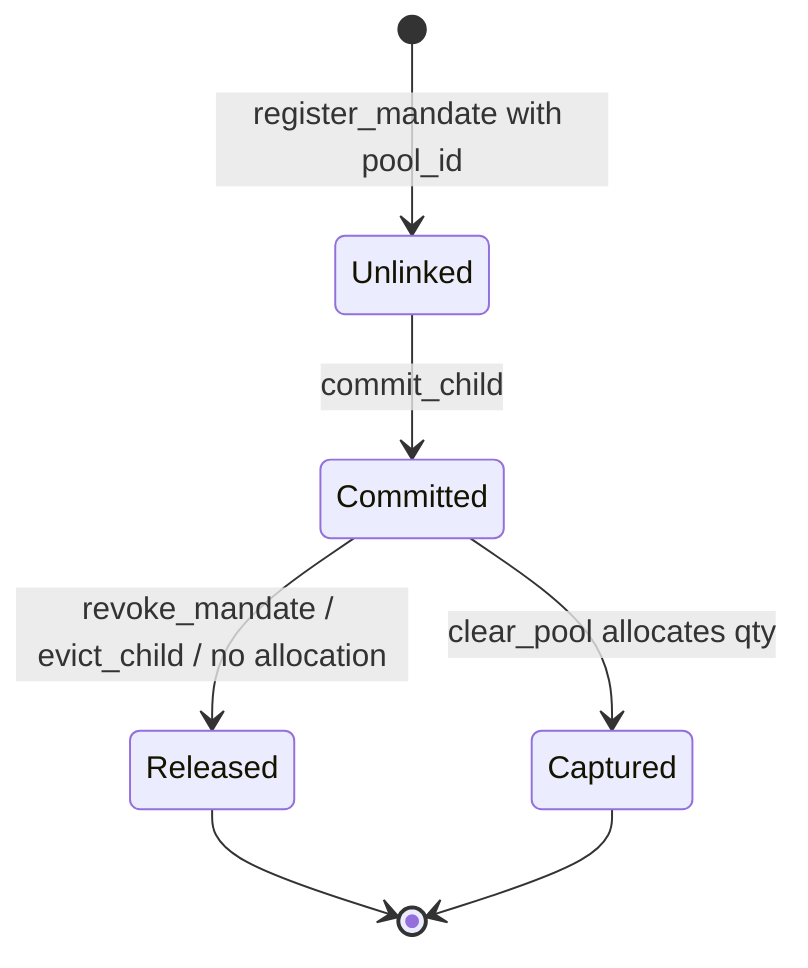
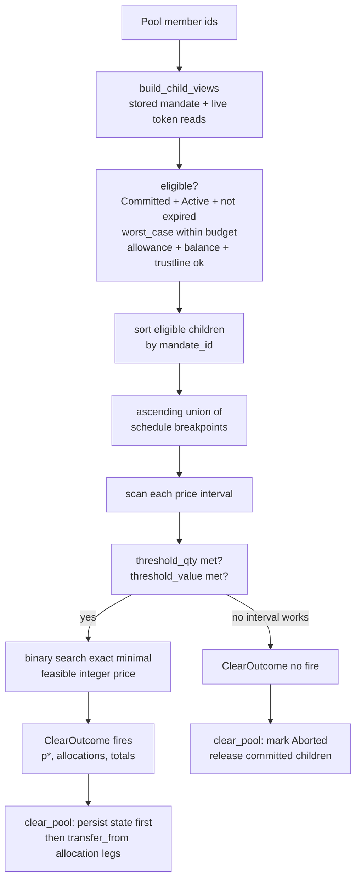

# Composite MandateRegistry

`contracts/composites/mandate-registry` is REAPP's composite mandate contract
with deterministic clearing pools. Release `0.3.0` keeps the full `0.2.0`
mandate and pool interface intact and adds admin-authorized emergency controls,
authority rotation, and same-address WASM upgrades.

It extends the simple mandate path with deterministic group clearing: money
moves only through `execute_payment` for standalone mandates or `clear_pool` for
composite capture. Each path validates and consumes atomically before
transferring. The SDK is untrusted; this contract is the source of truth.

Built with `soroban-sdk` v22 for the `wasm32v1-none` target. The historical
`v0.2.0` source-verified deployment remains unchanged and is documented below.

Everything below is code-backed: public methods come from `src/lib.rs`, the
money paths come from `src/payment.rs` and `src/pool.rs`, and the allocation
algorithm comes from `src/clearing.rs`.

## Architecture



The composite contract keeps the same narrow enforcement idea as the simple
contract, then adds a pure clearing core. Pool allocation is computed from
on-chain state, so the originator sets terms once and cannot later choose who
pays or at what price.

## Enforcement Architecture

```mermaid
flowchart LR
    Terms["Pool terms\noriginator, merchant, asset,\nthresholds, deadline, nonce"]
    PoolId["register_pool\npool id = hash(terms)"]
    Mandates["Pool-bound mandates\nuser auth + demand curves"]
    Commit["commit_child\nobjective eligibility"]
    Builder["build_child_views\nstored state + live token reads"]
    Pure["clearing::clear\npure allocation function"]
    Outcome["ClearOutcome\nfires, p*, allocations"]
    Pause["Operational pause gate\nadmin controlled"]
    Persist["Persist terminal state first\npool + child mandates"]
    Transfer["SEP-41 transfer_from\nallocation legs"]
    Merchant["Merchant receives settlement"]
    Sim["simulate_clear\nsame builder + same pure function"]
    Abort["No fire\nrelease committed children"]
    Stops["Bad terms / ineligible child /\nwrong asset / wrong merchant\nrejected before capture"]
    Stopped["Capture stopped\nno state or funds move"]

    Terms --> PoolId
    PoolId --> Mandates --> Commit --> Builder --> Pure --> Outcome
    Builder --> Sim --> Pure
    Outcome -->|"fires"| Pause --> Persist --> Transfer --> Merchant
    Pause -->|"stopped"| Stopped
    Outcome -->|"no fire"| Abort
    Commit --> Stops
    Builder --> Stops

    classDef core fill:#052e16,stroke:#22c55e,color:#f9fafb
    classDef pure fill:#312e81,stroke:#a78bfa,color:#f9fafb
    classDef wall fill:#111827,stroke:#ef4444,color:#f9fafb
    classDef read fill:#172554,stroke:#60a5fa,color:#f9fafb
    class PoolId,Mandates,Commit,Builder,Outcome,Persist,Transfer core
    class Pure pure
    class Stops,Abort,Stopped wall
    class Sim read
```



The architecture separates power from settlement: the originator commits terms
once, users commit their own curves, anyone can trigger the close, and the
allocation comes from a pure function over on-chain state rather than organizer
discretion.

## Administration and Upgrades



The emergency stop blocks only money movement: `execute_payment` and the firing
capture branch of `clear_pool`. A pool that cannot fire may still abort and
release children while paused; registration, commitment, eviction, simulation,
reads, and user revocation also remain available. The operating sequence
schedules an exact release hash, waits 24 hours, pauses before execution, and
unpauses only after same-address live gate checks pass.

### Operational State

| Storage key | Type | Initial value | Purpose |
|---|---|---|---|
| `Admin` | instance `Address` | constructor `admin` | Authorizes `set_admin`, `pause`, `unpause`, and the upgrade lifecycle. |
| `Paused` | instance `bool` | `false` | Stops solo payment and firing pool capture with `Paused = 10` before state or funds move. |
| `PendingUpgrade` | instance `Option<PendingUpgrade>` | `None` | Stores the proposed WASM hash and `execute_after` timestamp. |

`schedule_upgrade(new_wasm_hash)` stores the uploaded `BytesN<32>` executable
hash and an execution time 86,400 seconds later. `execute_upgrade()` requires
the current admin, elapsed delay, and paused state before calling the
current-contract WASM update operation. The contract ID, `Admin`, `Paused`,
persistent `Mandate` records, pools, and membership lists remain at the same
address; an upgrade does not rerun `__constructor`. The admin can remove a
proposal with `cancel_upgrade()` before execution.

The test suite exercises the complete positive lifecycle with uploaded
replacement WASM: delay-minus-one rejection, exact-time rejection while
unpaused, paused execution, a replacement method at this same contract address,
and preserved administrator, pause, pending-upgrade, and mandate storage.

## Pool Lifecycle



## Pool State



## Child Mandate State



Committed child mandates can be revoked while the pool remains open. Captured
children are consumed by the pool path; released children can use the solo path
only if their mandate status and budget still allow it.

## Clearing Algorithm



The clearing function itself has no storage, no clock, and no token calls. It
receives plain child views, filters to eligible members, scans demand-curve
breakpoints in ascending order, and returns the first globally minimal uniform
price that satisfies the pool thresholds.

## Public Methods

| Method | Auth | Mutates | Returns | What it proves |
|---|---|---:|---|---|
| `__constructor(admin)` | Deployment | Yes | `()` | The initial operational authority is set atomically with deployment. |
| `get_admin()` | None | No | `Address` | Anyone can inspect the current operational authority. |
| `set_admin(new_admin)` | current `admin` | Yes | `()` | Authority can rotate without replacing the contract. |
| `pause()` | current `admin` | Yes | `()` | Both money paths are stopped; repeated calls are safe. |
| `unpause()` | current `admin` | Yes | `()` | Both money paths are restored; repeated calls are safe. |
| `is_paused()` | None | No | `bool` | Apps and operators can inspect the emergency-stop state. |
| `schedule_upgrade(new_wasm_hash)` | current `admin` | Yes | `u64` | Records a release hash and returns its earliest execution time. |
| `cancel_upgrade()` | current `admin` | Yes | `()` | Removes the pending upgrade before execution. |
| `execute_upgrade()` | current `admin` | Yes | `()` | After 24 hours and while paused, changes the executable without changing the contract ID or storage. |
| `get_pending_upgrade()` | None | No | `Option<PendingUpgrade>` | Exposes the pending hash and earliest execution time. |
| `get_upgrade_delay()` | None | No | `u64` | Returns the fixed delay, `86,400` seconds. |
| `register_mandate(user, agent, merchant, asset, max_amount, expiry, vc_hash, pool_id, price_schedule)` | `user` | Yes | `BytesN<32>` mandate id | The user authorized either a standalone mandate or a pool-bound demand curve. |
| `validate_mandate(mandate_id, amount, merchant)` | None | No | `()` | The solo mandate rules accept a spend without consuming it; `is_paused` reports the separate operational state. |
| `execute_payment(mandate_id, amount, expected_seq)` | `agent` | Yes | `()` | The solo-path spend was validated, consumed, sequence-checked, and transferred atomically. |
| `revoke_mandate(mandate_id)` | stored `user` | Yes | `()` | The user withdrew consent and frees a committed pool slot when applicable. |
| `get_mandate(mandate_id)` | None | No | `Mandate` | Anyone can inspect stored mandate state, including pool binding. |
| `register_pool(originator, merchant, asset, kind, threshold_qty, threshold_value, min_child_value, clearing_deadline, nonce)` | `originator` | Yes | `BytesN<32>` pool id | The originator committed to exact pool terms by hash. |
| `commit_child(mandate_id)` | None | Yes | `()` | A pool-bound mandate objectively qualifies for the pool and occupies a slot. |
| `evict_child(pool_id, mandate_id)` | None | Yes | `()` | An objectively ineligible child can be removed, but an eligible child cannot. |
| `clear_pool(pool_id)` | None | Yes | `()` | The pool either captures all eligible settlement atomically or aborts with nobody paying. |
| `simulate_clear(pool_id)` | None | No | `ClearOutcome` | Anyone can recompute the exact outcome `clear_pool` would execute. |
| `get_pool(pool_id)` | None | No | `ClearingPool` | Anyone can inspect pool terms and status. |
| `get_pool_members(pool_id)` | None | No | `Vec<BytesN<32>>` | Anyone can inspect current member mandate ids. |

## Enforced Invariants

- Deterministic pool id: pool identity commits to the exact terms.
- Permissionless maintenance: commit, evict, simulate, and clear use objective
  checks instead of organizer discretion.
- Pure clearing core: allocation logic has no storage writes or token calls.
- Same-builder simulation: `simulate_clear` and `clear_pool` build child views
  the same way and call the same clearing function.
- Atomic settlement: a pool captures every leg in one transaction or aborts.
- Solo safety preserved: solo-path mandates keep the simple contract's
  validation, sequence, budget, merchant, expiry, and revoke rules.
- Capture-time eligibility: allowance, balance, trustline authorization, expiry,
  budget, status, and committed state are checked at capture time.
- Reentrancy shape: pool status and member state are persisted before token
  transfers.
- Narrow emergency stop: solo payment and firing capture fail before state or
  funds move, while abort and user-exit paths remain available.
- Admin isolation: only the stored admin can pause, unpause, rotate authority,
  schedule, cancel, or execute an upgrade.
- Stable upgrade boundary: every `0.2.0` method, type, and stored pool/mandate
  encoding remains compatible.

## Release 0.3.0

| | |
|---|---|
| Status | Deployed and live-checked on Stellar testnet |
| Source tag | `composites-v0.3.0` at `eed2fc012b1eee9a7345d353c55e7f575167dcfc` |
| Role | Separate composite MandateRegistry deployment |
| Constructor | `admin: Address` |
| Admin | `GA2B3YY27OY6AWT2VXMXUDBSAHVOLU2ST6QWJJJLOIGDQHJDXO4RL4XH` |
| Contract id | [`CCYRF7FKYGSNWX5I7WLYXZ6LNUNVCSPE4BOTQFVWVTABOHAP52DYHEYW`](https://stellar.expert/explorer/testnet/contract/CCYRF7FKYGSNWX5I7WLYXZ6LNUNVCSPE4BOTQFVWVTABOHAP52DYHEYW) |
| Release artifact | [`mandate-registry_v0.3.0.wasm`](https://github.com/reapp-protocol/reapp-protocol-contracts/releases/tag/composites-v0.3.0_contracts_composites_mandate_registry_mandate-registry_pkg0.3.0_cli25.1.0) |
| Artifact and on-chain hash | `b3368d7fb68017d078792b125dff0389d4c4c893c86fb075baeb9100f0e0f0a1` |
| Build attestation | [GitHub provenance](https://github.com/reapp-protocol/reapp-protocol-contracts/attestations/34875680) |
| Deployment transaction | [`a93d1d7d34132cc185d1a89f4fa2c669fba7ff4b1ca1798ab921250776b35bbb`](https://stellar.expert/explorer/testnet/tx/a93d1d7d34132cc185d1a89f4fa2c669fba7ff4b1ca1798ab921250776b35bbb) |
| Live pause transaction | [`8f88917148e8c731b666e9d3126b6ad80a25e7d88beebc2b640d966abb03f70f`](https://stellar.expert/explorer/testnet/tx/8f88917148e8c731b666e9d3126b6ad80a25e7d88beebc2b640d966abb03f70f) |
| Live unpause transaction | [`0e92c65468890cbf5e023da8f2875cf5885c12de86d95b2d9a1a3c7f2560e4f2`](https://stellar.expert/explorer/testnet/tx/0e92c65468890cbf5e023da8f2875cf5885c12de86d95b2d9a1a3c7f2560e4f2) |
| New error | `Paused = 10` |
| Compatibility | Every `0.2.0` mandate, pool, clearing, and read method is unchanged |

Live checks confirmed `get_admin`, `is_paused = false`, `pause`,
`is_paused = true`, `unpause`, and the final `is_paused = false` state.

## Historical Verified Deployment

The immutable `v0.2.0` composite MandateRegistry remains live on **Stellar
testnet**. It does not contain the `0.3.0` admin or upgrade methods:

| | |
|---|---|
| Contract id | [`CBALARHTO5D7JLWHZ5KST4QNIRC64JI5H3DQDHMIUBSRLLOVS6FCWOQX`](https://stellar.expert/explorer/testnet/contract/CBALARHTO5D7JLWHZ5KST4QNIRC64JI5H3DQDHMIUBSRLLOVS6FCWOQX) |
| Network | Stellar testnet |
| WASM hash | `6333c20b490a570ed7b1c8cbfbf382da00ee8a0d1e4ef1ba013d02fa1cf16f44` |
| Deployed | 2026-07-05 from the v0.2.0 release artifact, source-verified on StellarExpert |
| Source anchor | Tag `v0.2.0` |
| Release artifact | `release-artifact/mandate-registry_v0.2.0.wasm` |

Confirm the deployed bytecode matches this source:

```
stellar contract fetch --id CBALARHTO5D7JLWHZ5KST4QNIRC64JI5H3DQDHMIUBSRLLOVS6FCWOQX --network testnet --out-file onchain.wasm
shasum -a 256 onchain.wasm
# 6333c20b490a570ed7b1c8cbfbf382da00ee8a0d1e4ef1ba013d02fa1cf16f44
```

## Source Verification

The `v0.2.0` tag and matching release artifact remain the historical
source-verification anchor. The current `0.3.0` testnet deployment uses the
exact hosted artifact and matching on-chain hash recorded above.

Build and test from this folder:

```
cd contracts/composites/mandate-registry
cargo fmt --all -- --check
cargo clippy --all-targets -- -D warnings
cargo test
cargo build --target wasm32v1-none --release
```

Future same-address upgrades repeat the tagged artifact, attestation, interface,
and hash checks; upload the exact WASM, call
`schedule_upgrade(new_wasm_hash)`, wait 24 hours, pause, call
`execute_upgrade()`, rerun live checks at the same contract ID, then unpause.
