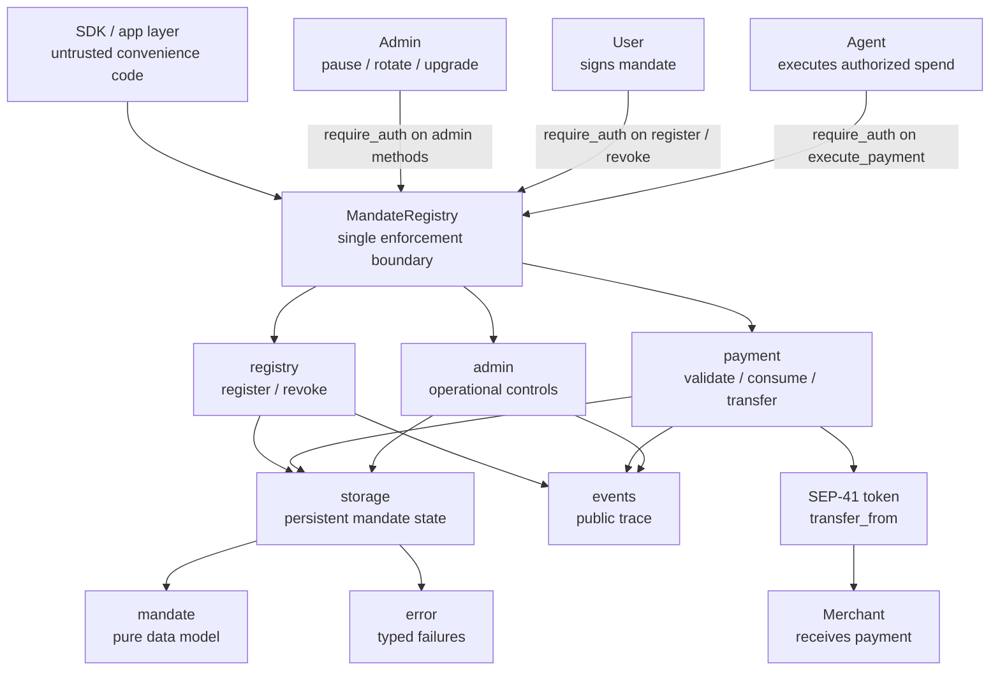
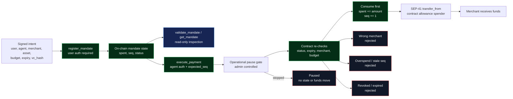
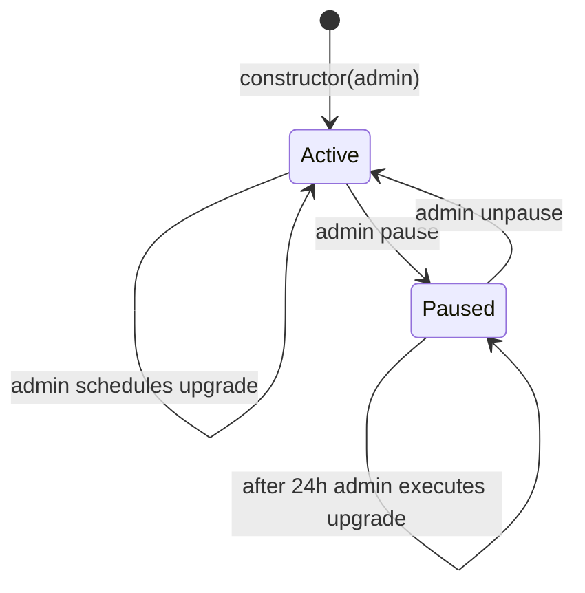
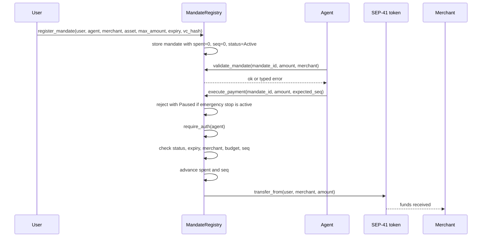
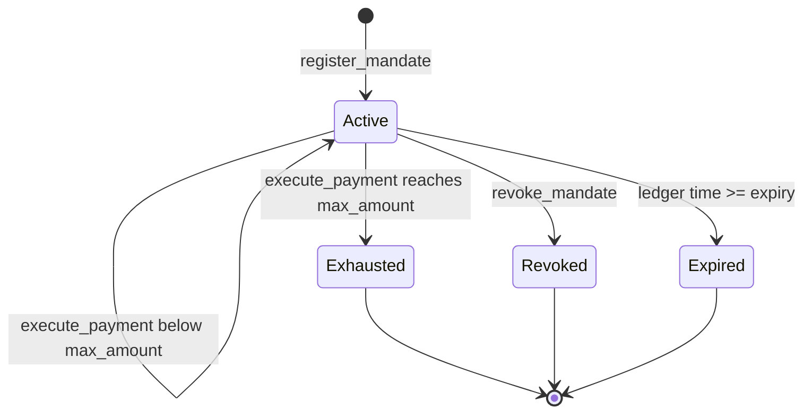

# Simple MandateRegistry

`contracts/simple/mandate-registry` is REAPP's minimal mandate contract and the
reference contract for the public SDK. Release `0.2.0` keeps the original
mandate interface intact and adds an admin-authorized emergency stop, authority
rotation, and same-address WASM upgrades.

It is REAPP's minimal enforcement layer: a user signs a mandate, the contract
stores it, and funds can move only through `execute_payment`, which validates
and consumes the mandate atomically before transferring. The SDK is untrusted;
this contract is the source of truth.

Built with `soroban-sdk` v22 for the `wasm32v1-none` target. The historical
`v0.1.0` source-verified deployment remains unchanged and is documented below.

Everything below is code-backed: public methods come from `src/lib.rs`, the
money path comes from `src/payment.rs`, and mandate lifecycle rules come from
`src/registry.rs`.

## Architecture



The important shape is narrow: all state changes pass through the contract, all
money movement passes through `execute_payment`, and the token transfer happens
only after the mandate has been re-validated and consumed.

## Enforcement Architecture



The architecture is the design: authorization enters once, state lives on-chain,
every spend re-enters through the contract, and all unsafe branches terminate
before the token call.

## Administration and Upgrades



The pause is intentionally narrow: it blocks only `execute_payment`, the sole
money-moving path. Registration, validation, reads, and user revocation remain
available, so an emergency stop cannot trap consent or mutate mandate state.
The operating sequence schedules an exact release hash, waits 24 hours, pauses,
executes the upgrade at the same contract address, verifies the executable and
state, then unpauses only after live gate checks pass.

### Operational State

| Storage key | Type | Initial value | Purpose |
|---|---|---|---|
| `Admin` | instance `Address` | constructor `admin` | Authorizes `set_admin`, `pause`, `unpause`, and the upgrade lifecycle. |
| `Paused` | instance `bool` | `false` | Makes `execute_payment` return `Paused = 10` before mandate state or funds move. |
| `PendingUpgrade` | instance `Option<PendingUpgrade>` | `None` | Stores the proposed WASM hash and `execute_after` timestamp. |

`schedule_upgrade(new_wasm_hash)` stores the uploaded `BytesN<32>` executable
hash and an execution time 86,400 seconds later. `execute_upgrade()` requires
the current admin, elapsed delay, and paused state before calling the
current-contract WASM update operation. The contract ID, `Admin`, `Paused`, and
all persistent `Mandate` records remain at the same address; an upgrade does
not rerun `__constructor`. The admin can remove a proposal with
`cancel_upgrade()` before execution.

## Payment Flow



## Mandate State



`Expired` is not stored as a status; it is enforced from ledger time during
validation and execution.

## Public Methods

| Method | Auth | Mutates | Returns | What it proves |
|---|---|---:|---|---|
| `__constructor(admin)` | Deployment | Yes | `()` | The initial operational authority is set atomically with deployment. |
| `get_admin()` | None | No | `Address` | Anyone can inspect the current operational authority. |
| `set_admin(new_admin)` | current `admin` | Yes | `()` | Authority can rotate without replacing the contract. |
| `pause()` | current `admin` | Yes | `()` | The sole money path is stopped; repeated calls are safe. |
| `unpause()` | current `admin` | Yes | `()` | The sole money path is restored; repeated calls are safe. |
| `is_paused()` | None | No | `bool` | Apps and operators can inspect the emergency-stop state. |
| `schedule_upgrade(new_wasm_hash)` | current `admin` | Yes | `u64` | Records a release hash and returns its earliest execution time. |
| `cancel_upgrade()` | current `admin` | Yes | `()` | Removes the pending upgrade before execution. |
| `execute_upgrade()` | current `admin` | Yes | `()` | After 24 hours and while paused, changes the executable without changing the contract ID or storage. |
| `get_pending_upgrade()` | None | No | `Option<PendingUpgrade>` | Exposes the pending hash and earliest execution time. |
| `get_upgrade_delay()` | None | No | `u64` | Returns the fixed delay, `86,400` seconds. |
| `register_mandate(user, agent, merchant, asset, max_amount, expiry, vc_hash)` | `user` | Yes | `BytesN<32>` mandate id | The user authorized the exact merchant, asset, budget, expiry, and agent. |
| `validate_mandate(mandate_id, amount, merchant)` | None | No | `()` | The mandate rules accept a spend without consuming it; `is_paused` reports the separate operational state. |
| `execute_payment(mandate_id, amount, expected_seq)` | `agent` | Yes | `()` | The authorized spend was validated, consumed, sequence-checked, and transferred atomically. |
| `revoke_mandate(mandate_id)` | stored `user` | Yes | `()` | The user withdrew consent before further spending. |
| `get_mandate(mandate_id)` | None | No | `Mandate` | Anyone can inspect the stored authorization state. |

## Enforced Invariants

- No SDK trust: off-chain code prepares requests, but the contract enforces the
  mandate.
- Atomic consume-before-transfer: replay and partial-failure paths revert.
- Sequence guard: `expected_seq` must match the stored mandate sequence.
- Cumulative budget guard: every payment checks `spent + amount <= max_amount`.
- Merchant binding: a mandate cannot be redirected to another merchant.
- User exit: `revoke_mandate` closes the mandate with user auth.
- Narrow emergency stop: pause rejects payment before mandate state or funds move.
- Admin isolation: only the stored admin can pause, unpause, rotate authority,
  schedule, cancel, or execute an upgrade.
- Stable upgrade boundary: existing method signatures and stored mandate encoding
  remain compatible across implementation upgrades.
- Typed errors and events make failures and successful state changes visible.

## Release 0.2.0

| | |
|---|---|
| Status | Deployed and live-checked on Stellar testnet |
| Source tag | `simple-v0.2.0` at `eed2fc012b1eee9a7345d353c55e7f575167dcfc` |
| SDK role | Default simple MandateRegistry for `@reapp-sdk/stellar` |
| Constructor | `admin: Address` |
| Admin | `GA2B3YY27OY6AWT2VXMXUDBSAHVOLU2ST6QWJJJLOIGDQHJDXO4RL4XH` |
| Contract id | [`CC6JMPDHRPBR2HBLJKRCIKV54HXDV2RFXDKW6MALQKWM6JEAJQHICRWE`](https://stellar.expert/explorer/testnet/contract/CC6JMPDHRPBR2HBLJKRCIKV54HXDV2RFXDKW6MALQKWM6JEAJQHICRWE) |
| Release artifact | [`mandate-registry_v0.2.0.wasm`](https://github.com/reapp-protocol/reapp-protocol-contracts/releases/tag/simple-v0.2.0_contracts_simple_mandate_registry_mandate-registry_pkg0.2.0_cli25.1.0) |
| Artifact and on-chain hash | `13f7023d4a361b6e49d3d39f61f55c5eeece51a602013a3cddae420d2ce8552b` |
| Build attestation | [GitHub provenance](https://github.com/reapp-protocol/reapp-protocol-contracts/attestations/34875671) |
| Deployment transaction | [`8de14e51a41aaad7a59d91efdff8e587d6f8d31e30688b992257f9dd84c5f066`](https://stellar.expert/explorer/testnet/tx/8de14e51a41aaad7a59d91efdff8e587d6f8d31e30688b992257f9dd84c5f066) |
| Live pause transaction | [`a80eb9cdbb9ca66b53bed4181a9f28ff5dd3560480abb4903b6ee4be68be03b4`](https://stellar.expert/explorer/testnet/tx/a80eb9cdbb9ca66b53bed4181a9f28ff5dd3560480abb4903b6ee4be68be03b4) |
| Live unpause transaction | [`8c9b905c34ed54d33defc07e5827a5ce5bef27175c85151c63dc72e2a732ff2d`](https://stellar.expert/explorer/testnet/tx/8c9b905c34ed54d33defc07e5827a5ce5bef27175c85151c63dc72e2a732ff2d) |
| New error | `Paused = 10` |
| Compatibility | All five original methods and the `Mandate` encoding are unchanged |

Live checks confirmed `get_admin`, `is_paused = false`, `pause`,
`is_paused = true`, `unpause`, and the final `is_paused = false` state.

## Historical Verified Deployment

The immutable `v0.1.0` simple MandateRegistry remains live on **Stellar
testnet**. It does not contain the `0.2.0` admin or upgrade methods:

| | |
|---|---|
| Contract id | [`CB4KOTLGMM5JEPFPU6QBJLADIBP3RSGUX44FOYTFRICNXKKFPYIW7ZOA`](https://stellar.expert/explorer/testnet/contract/CB4KOTLGMM5JEPFPU6QBJLADIBP3RSGUX44FOYTFRICNXKKFPYIW7ZOA) |
| Network | Stellar testnet |
| WASM hash | `4eb1b9430bd4a978348e7efc283a0bf599df048216a43b582921c17daed8c69e` |
| Deployed | 2026-06-19, source-verified on StellarExpert |
| Source anchor | Tag `v0.1.0` |
| Release artifact | `release-artifact/mandate-registry_v0.0.0.wasm` |

Confirm the deployed bytecode matches this source:

```
stellar contract fetch --id CB4KOTLGMM5JEPFPU6QBJLADIBP3RSGUX44FOYTFRICNXKKFPYIW7ZOA --network testnet --out-file onchain.wasm
shasum -a 256 onchain.wasm
# 4eb1b9430bd4a978348e7efc283a0bf599df048216a43b582921c17daed8c69e
```

## Source Verification

The `v0.1.0` tag and matching release artifact remain the historical
source-verification anchor. The current `0.2.0` testnet deployment uses the
exact hosted artifact and matching on-chain hash recorded above.

Future simple-contract verification releases should build from this folder:

```
cd contracts/simple/mandate-registry
cargo fmt --all -- --check
cargo clippy --all-targets -- -D warnings
cargo test
cargo build --target wasm32v1-none --release
```

Future same-address upgrades repeat the tagged artifact, attestation, interface,
and hash checks; upload the exact WASM, call
`schedule_upgrade(new_wasm_hash)`, wait 24 hours, pause, call
`execute_upgrade()`, rerun live checks at the same contract ID, then unpause.
