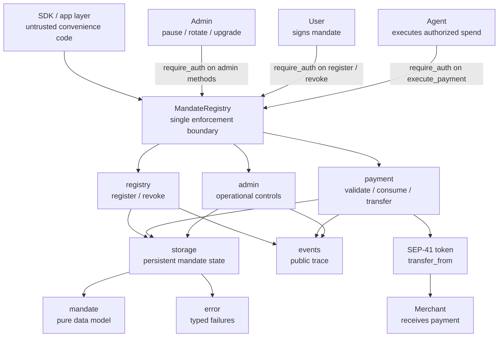
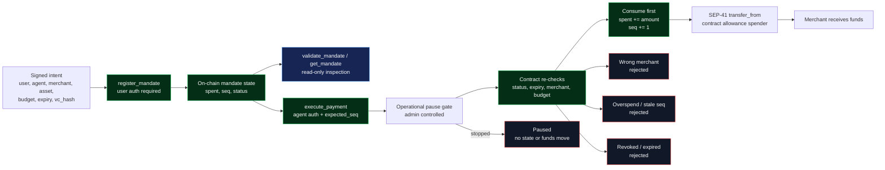
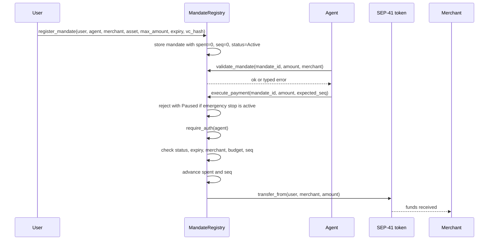
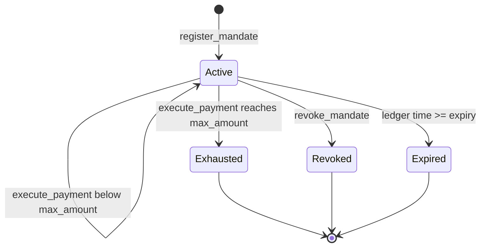

# Simple MandateRegistry

`contracts/simple/mandate-registry` is REAPP's minimal mandate contract and the
reference contract for the public SDK. Release `0.2.0` keeps the original
mandate interface intact and adds an admin-authorized emergency stop, authority
rotation, and same-address WASM upgrades.

It is REAPP's minimal enforcement layer: a user signs a mandate, the contract
stores it, and funds can move only through `execute_payment`, which validates
and consumes the mandate atomically before transferring. The SDK is untrusted;
this contract is the source of truth.

Built with `soroban-sdk` v22 for the `wasm32v1-none` target. The historical
`v0.1.0` source-verified deployment remains unchanged and is documented below.

Everything below is code-backed: public methods come from `src/lib.rs`, the
money path comes from `src/payment.rs`, and mandate lifecycle rules come from
`src/registry.rs`.

## Architecture



The important shape is narrow: all state changes pass through the contract, all
money movement passes through `execute_payment`, and the token transfer happens
only after the mandate has been re-validated and consumed.

## Enforcement Architecture



The architecture is the design: authorization enters once, state lives on-chain,
every spend re-enters through the contract, and all unsafe branches terminate
before the token call.

## Administration and Upgrades


The pause is intentionally narrow: it blocks only `execute_payment`, the sole
money-moving path. Registration, validation, reads, and user revocation remain
available, so an emergency stop cannot trap consent or mutate mandate state.
The operating sequence schedules an exact release hash, waits one hour, pauses,
executes the upgrade at the same contract address, verifies the executable and
state, then unpauses only after live gate checks pass.

### Operational State

| Storage key | Type | Initial value | Purpose |
|---|---|---|---|
| `Admin` | instance `Address` | constructor `admin` | Authorizes `set_admin`, `pause`, `unpause`, and the upgrade lifecycle. |
| `Paused` | instance `bool` | `false` | Makes `execute_payment` return `Paused = 10` before mandate state or funds move. |
| `PendingUpgrade` | instance `Option<PendingUpgrade>` | `None` | Stores the proposed WASM hash and `execute_after` timestamp. |

`schedule_upgrade(new_wasm_hash)` stores the uploaded `BytesN<32>` executable
hash and an execution time 3,600 seconds later. `execute_upgrade()` requires
the current admin, elapsed delay, and paused state before calling the
current-contract WASM update operation. The contract ID, `Admin`, `Paused`, and
all persistent `Mandate` records remain at the same address; an upgrade does
not rerun `__constructor`. The admin can remove a proposal with
`cancel_upgrade()` before execution.

The test suite exercises the complete positive lifecycle with uploaded
replacement WASM: delay-minus-one rejection, exact-time rejection while
unpaused, paused execution, a replacement method at this same contract address,
and preserved administrator, pause, pending-upgrade, and mandate storage.

## Payment Flow



## Mandate State



`Expired` is not stored as a status; it is enforced from ledger time during
validation and execution.

## Public Methods

| Method | Auth | Mutates | Returns | What it proves |
|---|---|---:|---|---|
| `__constructor(admin)` | Deployment | Yes | `()` | The initial operational authority is set atomically with deployment. |
| `get_admin()` | None | No | `Address` | Anyone can inspect the current operational authority. |
| `set_admin(new_admin)` | current `admin` | Yes | `()` | Authority can rotate without replacing the contract. |
| `pause()` | current `admin` | Yes | `()` | The sole money path is stopped; repeated calls are safe. |
| `unpause()` | current `admin` | Yes | `()` | The sole money path is restored; repeated calls are safe. |
| `is_paused()` | None | No | `bool` | Apps and operators can inspect the emergency-stop state. |
| `schedule_upgrade(new_wasm_hash)` | current `admin` | Yes | `u64` | Records a release hash and returns its earliest execution time. |
| `cancel_upgrade()` | current `admin` | Yes | `()` | Removes the pending upgrade before execution. |
| `execute_upgrade()` | current `admin` | Yes | `()` | After one hour and while paused, changes the executable without changing the contract ID or storage. |
| `get_pending_upgrade()` | None | No | `Option<PendingUpgrade>` | Exposes the pending hash and earliest execution time. |
| `get_upgrade_delay()` | None | No | `u64` | Returns the fixed delay, `3,600` seconds. |
| `register_mandate(user, agent, merchant, asset, max_amount, expiry, vc_hash)` | `user` | Yes | `BytesN<32>` mandate id | The user authorized the exact merchant, asset, budget, expiry, and agent. |
| `validate_mandate(mandate_id, amount, merchant)` | None | No | `()` | The mandate rules accept a spend without consuming it; `is_paused` reports the separate operational state. |
| `execute_payment(mandate_id, amount, expected_seq)` | `agent` | Yes | `()` | The authorized spend was validated, consumed, sequence-checked, and transferred atomically. |
| `revoke_mandate(mandate_id)` | stored `user` | Yes | `()` | The user withdrew consent before further spending. |
| `get_mandate(mandate_id)` | None | No | `Mandate` | Anyone can inspect the stored authorization state. |

## Enforced Invariants

- No SDK trust: off-chain code prepares requests, but the contract enforces the
  mandate.
- Atomic consume-before-transfer: replay and partial-failure paths revert.
- Sequence guard: `expected_seq` must match the stored mandate sequence.
- Cumulative budget guard: every payment checks `spent + amount <= max_amount`.
- Merchant binding: a mandate cannot be redirected to another merchant.
- User exit: `revoke_mandate` closes the mandate with user auth.
- Narrow emergency stop: pause rejects payment before mandate state or funds move.
- Admin isolation: only the stored admin can pause, unpause, rotate authority,
  schedule, cancel, or execute an upgrade.
- Stable upgrade boundary: existing method signatures and stored mandate encoding
  remain compatible across implementation upgrades.
- Typed errors and events make failures and successful state changes visible.

## Release 0.2.1 — One-Hour Upgrade Validation

| | |
|---|---|
| Status | Deployed, live-checked, and source-verified on Stellar testnet |
| Source tag | `simple-v0.2.1` at `7e388ddab9f52b2a9d9ac97e0ad358f63835d452` |
| SDK role | Default simple MandateRegistry for `@reapp-sdk/stellar` |
| Constructor | `admin: Address` |
| Admin | `GA2B3YY27OY6AWT2VXMXUDBSAHVOLU2ST6QWJJJLOIGDQHJDXO4RL4XH` |
| Contract id | [`CCHQ5G4Y4YBMY6D3TYYJSVJVCKUM22Q6TMKCCHVAHY4X7K6QELQACZRM`](https://stellar.expert/explorer/testnet/contract/CCHQ5G4Y4YBMY6D3TYYJSVJVCKUM22Q6TMKCCHVAHY4X7K6QELQACZRM) |
| Release artifact | [`mandate-registry_v0.2.1.wasm`](https://github.com/reapp-protocol/reapp-protocol-contracts/releases/download/simple-v0.2.1_contracts_simple_mandate_registry_mandate-registry_pkg0.2.1_cli25.1.0/mandate-registry_v0.2.1.wasm) |
| Artifact and on-chain hash | `ba370a80369daa0a0dea2554410dca6f2a9f7a76ba707cb92a83434e2fe76e87` |
| Build attestation | [GitHub provenance](https://github.com/reapp-protocol/reapp-protocol-contracts/attestations/36124459) |
| Fixed upgrade delay | `3,600` seconds (one hour) |
| WASM upload transaction | [`806b83b1bfb91155bce6fbcaae154943391a49d1ec1a8f606a2508ea8e6b3cea`](https://stellar.expert/explorer/testnet/tx/806b83b1bfb91155bce6fbcaae154943391a49d1ec1a8f606a2508ea8e6b3cea) |
| Deployment transaction | [`46679351ed75b3b07d7aa90dfbc2a58e7d3695d71d8fffa9fbcf89bff27f9317`](https://stellar.expert/explorer/testnet/tx/46679351ed75b3b07d7aa90dfbc2a58e7d3695d71d8fffa9fbcf89bff27f9317) |
| New error | `Paused = 10` |
| Compatibility | All five original methods and the `Mandate` encoding are unchanged |

Live checks confirmed the exact on-chain hash, `get_admin`,
`get_upgrade_delay = 3600`, `is_paused = false`, and no pending upgrade.

## Live Same-Address Upgrade Validation

Both upgrade steps are **VERIFIED LIVE** on Stellar testnet at the unchanged
contract id:

[`CCHQ5G4Y4YBMY6D3TYYJSVJVCKUM22Q6TMKCCHVAHY4X7K6QELQACZRM`](https://stellar.expert/explorer/testnet/contract/CCHQ5G4Y4YBMY6D3TYYJSVJVCKUM22Q6TMKCCHVAHY4X7K6QELQACZRM)

Step 1 added one temporary read-only method without changing the contract
address, mandate storage, payment behavior, administrator, or one-hour delay:

```rust
pub fn upgrade_test_version(_env: Env) -> u32 {
    1
}
```

After the full one-hour timelock, Step 2 restored the cleanup implementation.
The cleanup removes `upgrade_test_version()` while retaining the same contract
address, administrator, storage, payment behavior, and `3,600`-second delay.

| State | Release | WASM hash | Marker | Contract id |
|---|---|---|---|---|
| Baseline | [`simple-v0.2.1`](https://github.com/reapp-protocol/reapp-protocol-contracts/releases/tag/simple-v0.2.1_contracts_simple_mandate_registry_mandate-registry_pkg0.2.1_cli25.1.0) | `ba370a80369daa0a0dea2554410dca6f2a9f7a76ba707cb92a83434e2fe76e87` | absent | `CCHQ5G4Y4YBMY6D3TYYJSVJVCKUM22Q6TMKCCHVAHY4X7K6QELQACZRM` |
| Step 1 verified live | [`simple-v0.2.2`](https://github.com/reapp-protocol/reapp-protocol-contracts/releases/tag/simple-v0.2.2_contracts_simple_mandate_registry_mandate-registry_pkg0.2.2_cli25.1.0) | `627a4db17dff863a1520eda9774b11a3c10a101554ef7dcaf406de8a53906760` | `upgrade_test_version() -> 1` | `CCHQ5G4Y4YBMY6D3TYYJSVJVCKUM22Q6TMKCCHVAHY4X7K6QELQACZRM` |
| Step 2 verified live | [`simple-v0.2.3`](https://github.com/reapp-protocol/reapp-protocol-contracts/releases/tag/simple-v0.2.3_contracts_simple_mandate_registry_mandate-registry_pkg0.2.3_cli25.1.0) | `ba370a80369daa0a0dea2554410dca6f2a9f7a76ba707cb92a83434e2fe76e87` | absent | `CCHQ5G4Y4YBMY6D3TYYJSVJVCKUM22Q6TMKCCHVAHY4X7K6QELQACZRM` |

### Step 1 execution evidence

- Source commit: [`cecef5c5ffafd367cb97cccb4ddf84dd5b5191e3`](https://github.com/reapp-protocol/reapp-protocol-contracts/commit/cecef5c5ffafd367cb97cccb4ddf84dd5b5191e3)
- Schedule transaction: [`a979c6c01845d52c835b4ad902f8ec6c1be1002d281491ffa7c21e46167fa1f2`](https://stellar.expert/explorer/testnet/tx/a979c6c01845d52c835b4ad902f8ec6c1be1002d281491ffa7c21e46167fa1f2), with `execute_after = 1784544441`
- Early execute simulation: rejected with `Error(Contract,#12)`
- Pause transaction: [`0f819c419b2591e3baeaefdf3917458e12a3a5c889416d66fca41e9acf1d65a1`](https://stellar.expert/explorer/testnet/tx/0f819c419b2591e3baeaefdf3917458e12a3a5c889416d66fca41e9acf1d65a1)
- Execute transaction: [`ed626ad3db48fbbd1a87e7488d883915ecda0662b04ad11f1dfb1dfd0f6d024f`](https://stellar.expert/explorer/testnet/tx/ed626ad3db48fbbd1a87e7488d883915ecda0662b04ad11f1dfb1dfd0f6d024f)
- Unpause transaction: [`1d94a04c37402da5ca766872b373374948b5ecb5b5e97ac9b21e0ad93baf9aa2`](https://stellar.expert/explorer/testnet/tx/1d94a04c37402da5ca766872b373374948b5ecb5b5e97ac9b21e0ad93baf9aa2)
- Fixed upgrade delay before and after execution: `3,600` seconds

Final live checks confirmed the same contract id, exact v0.2.2 WASM hash,
unchanged admin `GA2B3YY27OY6AWT2VXMXUDBSAHVOLU2ST6QWJJJLOIGDQHJDXO4RL4XH`,
`get_pending_upgrade = null`, `get_upgrade_delay = 3600`,
`upgrade_test_version() = 1`, and `is_paused = false` before Step 2 began.

### Step 2 cleanup execution evidence

- Cleanup source commit: [`eab02453cf06efa914d043df5295995c4dbc7b57`](https://github.com/reapp-protocol/reapp-protocol-contracts/commit/eab02453cf06efa914d043df5295995c4dbc7b57)
- Cleanup artifact attestation: [GitHub provenance](https://github.com/reapp-protocol/reapp-protocol-contracts/attestations/36127795)
- Cleanup artifact hash: `ba370a80369daa0a0dea2554410dca6f2a9f7a76ba707cb92a83434e2fe76e87`
- Schedule transaction: [`a71f34c64ea158bd66aade1572262df591d88e76f5b5027d9572c3be8c790346`](https://stellar.expert/explorer/testnet/tx/a71f34c64ea158bd66aade1572262df591d88e76f5b5027d9572c3be8c790346), with `execute_after = 1784553702`
- Normal early execution: rejected during simulation with `Error(Contract,#12)`
- Deliberate early on-chain proof: [`3d88253b93603ddb1e1603dde12ad30b822c380cd71285fc5c68996d4133c3de`](https://stellar.expert/explorer/testnet/tx/3d88253b93603ddb1e1603dde12ad30b822c380cd71285fc5c68996d4133c3de), failed with `Error(Contract,#12)` and zero contract writes
- Pause transaction: [`9033f2865e7e3152d29fdc8ca8078ae83c19b5f1f1f17de79b100db71a864f7d`](https://stellar.expert/explorer/testnet/tx/9033f2865e7e3152d29fdc8ca8078ae83c19b5f1f1f17de79b100db71a864f7d)
- Execute transaction: [`afaa181115a6a1fd19c1ef22f70243dac9da333db99ef36bd0d6d4d90964f828`](https://stellar.expert/explorer/testnet/tx/afaa181115a6a1fd19c1ef22f70243dac9da333db99ef36bd0d6d4d90964f828)
- Unpause transaction: [`e5518da0ab72ed960c5b96e82e13182f79df943d79eaae1262296afba2bd6b53`](https://stellar.expert/explorer/testnet/tx/e5518da0ab72ed960c5b96e82e13182f79df943d79eaae1262296afba2bd6b53)

Final live checks confirmed the same full contract id, exact v0.2.3 cleanup
hash, unchanged admin
`GA2B3YY27OY6AWT2VXMXUDBSAHVOLU2ST6QWJJJLOIGDQHJDXO4RL4XH`,
`get_pending_upgrade = null`, `get_upgrade_delay = 3600`, and
`is_paused = false`. The live interface rejects `upgrade_test_version` as an
unknown method. StellarExpert reports
[source verified and Versions 3](https://stellar.expert/explorer/testnet/contract/CCHQ5G4Y4YBMY6D3TYYJSVJVCKUM22Q6TMKCCHVAHY4X7K6QELQACZRM).

This validates both directions of same-address upgradability with the real
one-hour timelock. npm packages were not changed or published.

## Previous Published v0.2.0 Deployment

| | |
|---|---|
| Source tag | `simple-v0.2.0` at `eed2fc012b1eee9a7345d353c55e7f575167dcfc` |
| Contract id | [`CC6JMPDHRPBR2HBLJKRCIKV54HXDV2RFXDKW6MALQKWM6JEAJQHICRWE`](https://stellar.expert/explorer/testnet/contract/CC6JMPDHRPBR2HBLJKRCIKV54HXDV2RFXDKW6MALQKWM6JEAJQHICRWE) |
| Release artifact | [`mandate-registry_v0.2.0.wasm`](https://github.com/reapp-protocol/reapp-protocol-contracts/releases/tag/simple-v0.2.0_contracts_simple_mandate_registry_mandate-registry_pkg0.2.0_cli25.1.0) |
| Artifact and on-chain hash | `13f7023d4a361b6e49d3d39f61f55c5eeece51a602013a3cddae420d2ce8552b` |
| Build attestation | [GitHub provenance](https://github.com/reapp-protocol/reapp-protocol-contracts/attestations/34875671) |
| Deployment transaction | [`8de14e51a41aaad7a59d91efdff8e587d6f8d31e30688b992257f9dd84c5f066`](https://stellar.expert/explorer/testnet/tx/8de14e51a41aaad7a59d91efdff8e587d6f8d31e30688b992257f9dd84c5f066) |

## Historical Verified Deployment

The immutable `v0.1.0` simple MandateRegistry remains live on **Stellar
testnet**. It does not contain the `0.2.0` admin or upgrade methods:

| | |
|---|---|
| Contract id | [`CB4KOTLGMM5JEPFPU6QBJLADIBP3RSGUX44FOYTFRICNXKKFPYIW7ZOA`](https://stellar.expert/explorer/testnet/contract/CB4KOTLGMM5JEPFPU6QBJLADIBP3RSGUX44FOYTFRICNXKKFPYIW7ZOA) |
| Network | Stellar testnet |
| WASM hash | `4eb1b9430bd4a978348e7efc283a0bf599df048216a43b582921c17daed8c69e` |
| Deployed | 2026-06-19, source-verified on StellarExpert |
| Source anchor | Tag `v0.1.0` |
| Release artifact | `release-artifact/mandate-registry_v0.0.0.wasm` |

Confirm the deployed bytecode matches this source:

```
stellar contract fetch --id CB4KOTLGMM5JEPFPU6QBJLADIBP3RSGUX44FOYTFRICNXKKFPYIW7ZOA --network testnet --out-file onchain.wasm
shasum -a 256 onchain.wasm
# 4eb1b9430bd4a978348e7efc283a0bf599df048216a43b582921c17daed8c69e
```

## Source Verification

The `v0.1.0` and `simple-v0.2.0` tags and matching release artifacts remain
historical source-verification anchors. The current same-address contract uses
the exact tagged `simple-v0.2.3` cleanup artifact and matching on-chain hash
recorded above. That cleanup digest is byte-for-byte identical to the verified
`simple-v0.2.1` baseline digest.

Future simple-contract verification releases should build from this folder:

```
cd contracts/simple/mandate-registry
cargo fmt --all -- --check
cargo clippy --all-targets -- -D warnings
cargo test
cargo build --target wasm32v1-none --release
```

Future same-address upgrades repeat the tagged artifact, attestation, interface,
and hash checks; upload the exact WASM, call
`schedule_upgrade(new_wasm_hash)`, wait one hour, pause, call
`execute_upgrade()`, rerun live checks at the same contract ID, then unpause.
