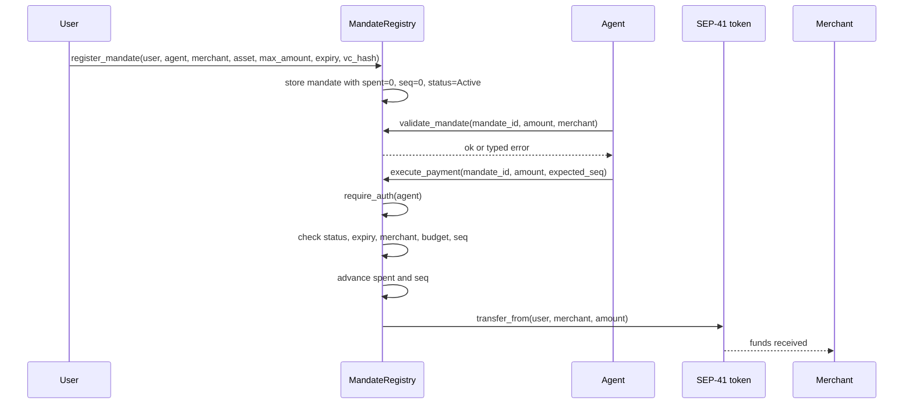
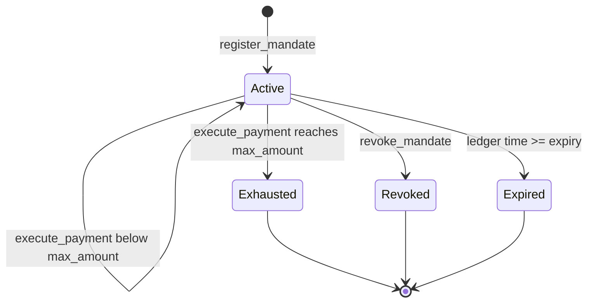

# Simple MandateRegistry

`contracts/simple/mandate-registry` is the simple REAPP mandate contract used
for the first successful source-verified submission.

It is REAPP's minimal enforcement layer: a user signs a mandate, the contract
stores it, and funds can move only through `execute_payment`, which validates
and consumes the mandate atomically before transferring. The SDK is untrusted;
this contract is the source of truth.

Built with `soroban-sdk` v22 for the `wasm32v1-none` target.

Everything below is code-backed: public methods come from `src/lib.rs`, the
money path comes from `src/payment.rs`, and mandate lifecycle rules come from
`src/registry.rs`.

## Architecture

```mermaid
flowchart TB
    SDK["SDK / app layer\nuntrusted convenience code"]
    User["User\nsigns mandate"]
    Agent["Agent\nexecutes authorized spend"]
    Merchant["Merchant\nreceives payment"]
    Contract["MandateRegistry\nsingle enforcement boundary"]
    Registry["registry\nregister / revoke"]
    Payment["payment\nvalidate / consume / transfer"]
    Storage["storage\npersistent mandate state"]
    Mandate["mandate\npure data model"]
    Error["error\ntyped failures"]
    Events["events\npublic trace"]
    Token["SEP-41 token\ntransfer_from"]

    SDK --> Contract
    User -->|"require_auth on register / revoke"| Contract
    Agent -->|"require_auth on execute_payment"| Contract
    Contract --> Registry
    Contract --> Payment
    Registry --> Storage
    Payment --> Storage
    Storage --> Mandate
    Storage --> Error
    Registry --> Events
    Payment --> Events
    Payment --> Token
    Token --> Merchant
```



The important shape is narrow: all state changes pass through the contract, all
money movement passes through `execute_payment`, and the token transfer happens
only after the mandate has been re-validated and consumed.

## Payment Flow



## Mandate State



`Expired` is not stored as a status; it is enforced from ledger time during
validation and execution.

## Public Methods

| Method | Auth | Mutates | Returns | What it proves |
|---|---|---:|---|---|
| `register_mandate(user, agent, merchant, asset, max_amount, expiry, vc_hash)` | `user` | Yes | `BytesN<32>` mandate id | The user authorized the exact merchant, asset, budget, expiry, and agent. |
| `validate_mandate(mandate_id, amount, merchant)` | None | No | `()` | A spend would be valid right now without consuming anything. |
| `execute_payment(mandate_id, amount, expected_seq)` | `agent` | Yes | `()` | The authorized spend was validated, consumed, sequence-checked, and transferred atomically. |
| `revoke_mandate(mandate_id)` | stored `user` | Yes | `()` | The user withdrew consent before further spending. |
| `get_mandate(mandate_id)` | None | No | `Mandate` | Anyone can inspect the stored authorization state. |

## Enforced Invariants

- No SDK trust: off-chain code prepares requests, but the contract enforces the
  mandate.
- Atomic consume-before-transfer: replay and partial-failure paths revert.
- Sequence guard: `expected_seq` must match the stored mandate sequence.
- Cumulative budget guard: every payment checks `spent + amount <= max_amount`.
- Merchant binding: a mandate cannot be redirected to another merchant.
- User exit: `revoke_mandate` closes the mandate with user auth.
- Typed errors and events make failures and successful state changes visible.

## Deployed Contract

The simple MandateRegistry is live on **Stellar testnet**:

| | |
|---|---|
| Contract id | [`CB4KOTLGMM5JEPFPU6QBJLADIBP3RSGUX44FOYTFRICNXKKFPYIW7ZOA`](https://stellar.expert/explorer/testnet/contract/CB4KOTLGMM5JEPFPU6QBJLADIBP3RSGUX44FOYTFRICNXKKFPYIW7ZOA) |
| Network | Stellar testnet |
| WASM hash | `4eb1b9430bd4a978348e7efc283a0bf599df048216a43b582921c17daed8c69e` |
| Deployed | 2026-06-19, source-verified on StellarExpert |
| Source anchor | Tag `v0.1.0` |
| Release artifact | `release-artifact/mandate-registry_v0.0.0.wasm` |

Confirm the deployed bytecode matches this source:

```
stellar contract fetch --id CB4KOTLGMM5JEPFPU6QBJLADIBP3RSGUX44FOYTFRICNXKKFPYIW7ZOA --network testnet --out-file onchain.wasm
shasum -a 256 onchain.wasm
# 4eb1b9430bd4a978348e7efc283a0bf599df048216a43b582921c17daed8c69e
```

## Source Verification

The source in this folder was restored from the verified `v0.1.0` contract
source. The source-verification anchor remains the historical tag and matching
release artifact, so the verified contract stays tied to the bytecode that was
actually deployed.

Future simple-contract verification releases should build from this folder:

```
cd contracts/simple/mandate-registry
cargo test
stellar contract build
```

Use `simple-v*` tags for future simple-contract release builds.
